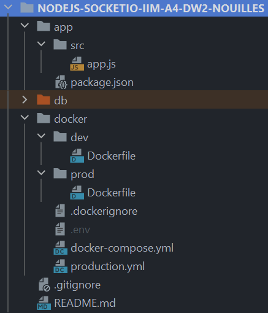
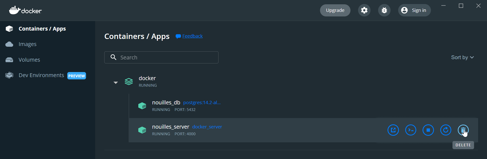
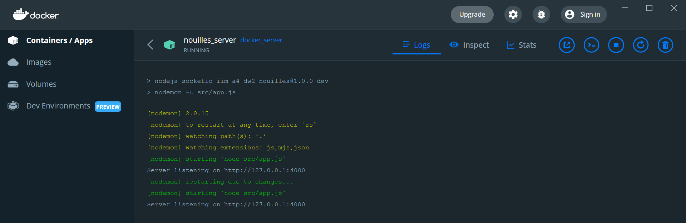

# Cours Node.js

Cours Node.js avec la classe A4 IWM M2

<!-- TABLE OF CONTENTS -->
<details open="open">
  <summary><h2 style="display: inline-block">Table des matières</h2></summary>
  <ol>
    <li>
      <a href="#prerequis">Prérequis</a>
    </li>
    <li>
      <a href="#faire-son-serveur">Faire son serveur</a>
    </li>
    <li>
      <a href="#ajouter-un-package-via-npm">Ajouter un package via npm</a>
    </li>
    <li>
      <a href="#les-exports-en-javascript">Les exports en javascript</a>
    </li>
    <li>
      <a href="#enlever-les-erreurs-cors">Enlever les erreurs CORS</a>
    </li>
    <li>
      <a href="#dockeriser-son-application">Dockeriser son application</a>
      <ul>
        <li><a href="#architecture-du-projet">Architecture du projet</a></li>
        <li><a href="#conteneur-base-de-données">Conteneur base de données</a></li>
        <li><a href="#conteneur-serveur">Conteneur serveur</a></li>        
        <li><a href="#fichier-env">Fichier .env</a></li>        
        <li><a href="#en-production">En production</a></li>       
        <li><a href="#lancer-les-conteneurs">Lancer les conteneurs</a></li>       
      </ul>
    </li>
  </ol>
</details>

# Prérequis

-   Un nordinateur
-   Wordpad
-   Node.js version 18

# Faire son serveur

Définition des constantes globales de l'application.

On utilise la librairie native `http` de Node.js

```js
const http = require("http");

const hostname = "127.0.0.1";
const port = 3000;
```

On crée le serveur avec les paramètres nescessaires

```js
const server = http.createServer((req, res) => {
    res.statusCode = 200;
    res.setHeader("Content-Type", "text/plain");
    res.end("Hello, World!\n");
});
```

On lance le serveur sur le port et l'hôte défini.

La fonction de callback permet de nous assurer de la bonne exécution de notre code.

```js
server.listen(port, hostname, () => {
    console.log(`Server running at http://${hostname}:${port}/`);
});
```


# Dockeriser son application
On peut conteneuriser son application pour éviter d'avoir à installer tout sur son ordinateur, et optionnellement faciliter le déploiement.

Il y a pour l'instant 2 parties dans l'application, et donc 2 conteneurs. On peut utiliser un `docker-compose.yml` pour gérer ces conteneurs.

## Architecture du projet
Je propose ici une certaine architecture pour le projet, mais soyez libres de l'adapter à votre goût ! Il faudra juste changer les chemins correspondants dans `docker-compose.yml`.



## Conteneur base de données
Une simple image postgres importée de dockerhub est suffisante ici.

```yml
# docker/docker-compose.yml
services:
  db:
    image: postgres:14.2-alpine
    restart: unless-stopped
    environment:
      POSTGRES_PASSWORD: ${DB_PASSWORD}
      POSTGRES_USER: ${DB_USER}
      POSTGRES_DB: ${DB_DATABASE}
    ports:
      - ${DB_PORT}:${DB_PORT}
    volumes:
      - ../db:/var/lib/postgresql/data
    networks:
      - <nom_du_réseau_personnalisé> # pour que les conteneurs puissent discuter entre eux
```

## Conteneur serveur
Il y a besoin de commandes supplémentaires pour lancer le serveur : c'est pourquoi on va écrire un Dockerfile.

```yml
# docker/docker-compose.yml
services:
  server:
    depends_on:
      - db
    build:
      context: ../app/ # avec quels fichiers on initialise le conteneur
      dockerfile: ../docker/dev/Dockerfile # où se trouve le Dockerfile, à partir du contexte
    restart: unless-stopped
    environment:
      CONNECTION_STRING: "postgresql://${DB_USER}:${DB_PASSWORD}@db:${DB_PORT}/${DB_DATABASE}"
      SERVER_PORT: ${SERVER_PORT}
      NODE_ENV: dev
    ports:
      - "${SERVER_PORT}:${SERVER_PORT}"
    volumes:
      - ../app/src:/app/src # pas app/ en entier pour éviter d'écraser d'écraser node_modules dans le conteneur
    networks:
      - <nom_du_réseau_personnalisé>
```

```dockerfile
# docker/dev/Dockerfile
FROM node:18-alpine3.14

RUN mkdir /app
WORKDIR /app
# Install the dependencies
COPY package.json ./
RUN npm ci
# Copy the source files
COPY . .

# Start the server
EXPOSE ${SERVER_PORT}
CMD npm run dev
# ou npx nodemon <nom_du_fichier_principal> si vous n'avez pas de script npm pour lancer le serveur en dev
```

## Fichier env
Les variables d'environnement sont placées dans un fichier `.env` lu automatiquement par `docker-compose`.

```env
DB_USER=<nom_d'utilisateur>
DB_PASSWORD=<mot_de_passe>
DB_HOST=localhost
DB_PORT=5432
DB_DATABASE=<nom_de_la_bdd>
SERVER_PORT=3000
```

## En production
La commande pour lancer le serveur en production est différente de celle en développement, c'est pourquoi il y a un `Dockerfile` et un `docker-compose.yml` différents pour cet environnement.

```yml
# docker/production.yml
version: "3.4"

services:
  server:
    build:
      context: ../app/
      dockerfile: ../docker/prod/Dockerfile
    environment:
      NODE_ENV: production
```
```dockerfile
FROM node:18-alpine3.14

RUN mkdir /app
WORKDIR /app
# Install the dependencies
COPY package.json ./
RUN npm install --omit dev
# Copy the source files
COPY . .

# Start the server
EXPOSE ${SERVER_PORT}
CMD npm run start
```

## Lancer les conteneurs

### Développement
Pour toutes ces commandes, il faut se placer dans le dossier `/docker`.

En développement :
`docker-compose up -d`

On peut ensuite accéder au serveur depuis l'extérieur du conteneur à l'adresse : `localhost:3000`

Après avoir installé un module npm via `npm i`, reconstruire les conteneurs en ligne de commande avec :
`docker-compose up -d --build`

Ou supprimer le conteneur avec Docker Desktop :



Puis relancer normalement avec `up`.

### Logs
Pour voir les logs, on peut soit utiliser la ligne de commande : `docker-compose logs -f <server ou db>`

Soit passer par Docker Desktop :


### Production
En production, idem, mais on ajoute la configuration pour la prod :
`docker-compose -f docker-compose.yml -f production.yml up -d`


# Ajouter un package via npm
Dans un premier temps, on ajoute la 'notion' de package dans le projet.  
```bash
npm init
```

Ensuite on installe dans le projet le package souhaité (ici nodemon)
```bash
npm install nodemon --Dev
```

`nodemon` permet de faciliter le développement en relançant automatiquement le serveur lors de modifications des fichiers sources. On peut l'ajouter aux scripts npm:
```json
"scripts" : {
 "dev": "nodemon <nom_du_fichier_principal>"
}
```

Puis le lancer avec `npm run dev`

# Les exports en javascript
Dans un fichier appart créer une fonction
```js
function returnHelloWorld() {
    const helloWorldObject = {
        msg: 'Hello World !'
    }
    return JSON.stringify(helloWorldObject);
}
```

Dans ce meme fichier exporter la fonction que l'on vient de créer
```js
module.exports = {returnHelloWorld};
```

Importer dans le fichier souhaité l'ensemble des exports du fichier
```js
const functions = require('./functions');
```

Il est maintenant possible d'utiliser les fonctions exportés dans le fichier importé
```js
functions.returnHelloWorld()
```

# Enlever les erreurs CORS

## Qu'est-ce qu'une erreur CORS

Tout d'abord, CORS est un acronyme signifiant "Cross Origin Resource Sharing".

Cela consiste à ajouter des en-têtes HTTP afin d'accéder par exemple à une API située sur
un serveur distant.
Ainsi, le user agent procède à une requête HTTP "cross-origin" lorsqu'il souhaite accéder
à un domaine, un port ou un protocole différent de la page courante.

Il apparaît donc des erreurs CORS lorsque nous n'avons pas les droits d'accéder notamment à des URL distantes.

## Résoudre les erreurs CORS dans un projet NodeJS-Express

Il faut dans un premier temps installer un middleware que l'on retrouve dans un simple paquet NPM.
```bash
npm i cors
```
Ensuite, il suffit d'ajouter à la racine de votre projet les lignes suivantes :
```bash
var express = require('express');
var cors = require('cors');
var app = express();

app.use(cors());
```
