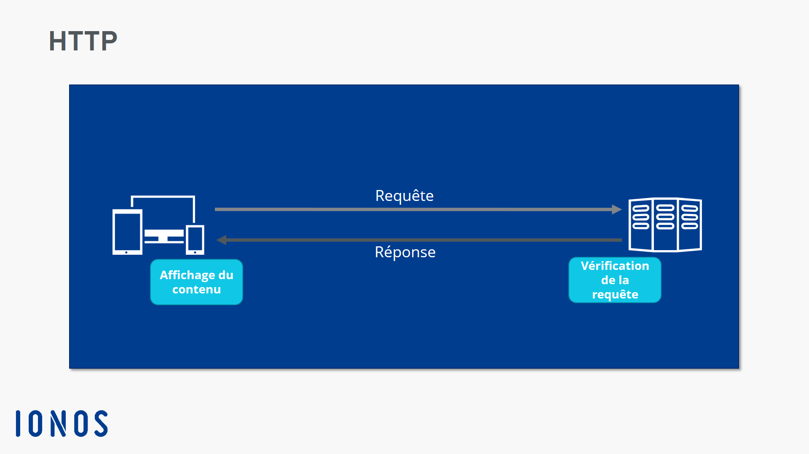
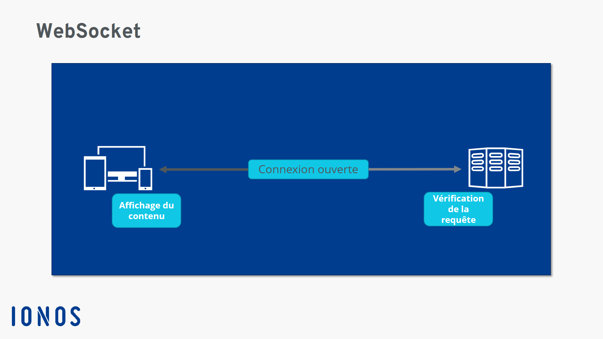

# Socket.io

Socket.io est un module de node permettant de creer des WebSocket. Ces memes WebSocket sont en fait des connexions bi-directionnelles entre le client et le serveur. Pour ce genre de requete on utilise pas le protocole HTTP mais le protocole TCP.
Ce qui fait que cette requetes est différentes d'une http est qu'elle n'a pas besoin d'etre exécuté que par le client pour recevoir des données du serveur.

Imaginons deux cas concrets :
- Si, on fait une requete http depuis un moteur de recherche cela se presente sous la forme suivante : 

Le client fait une requete au serveur qui va la traiter en renvoyer le resultat. Simple non ?

- Dans le cas d'un Web Socket c'est presque la meme chose sauf que le le serveur peut envoyer des
données au client sans qu'il n'emmette de requete

C'est sur ce principe que se base Socket.io 
et c'est ce qui fait que chaque utilisateurs peuvent etre connecté sur un meme url et recevoir les données simultanéement